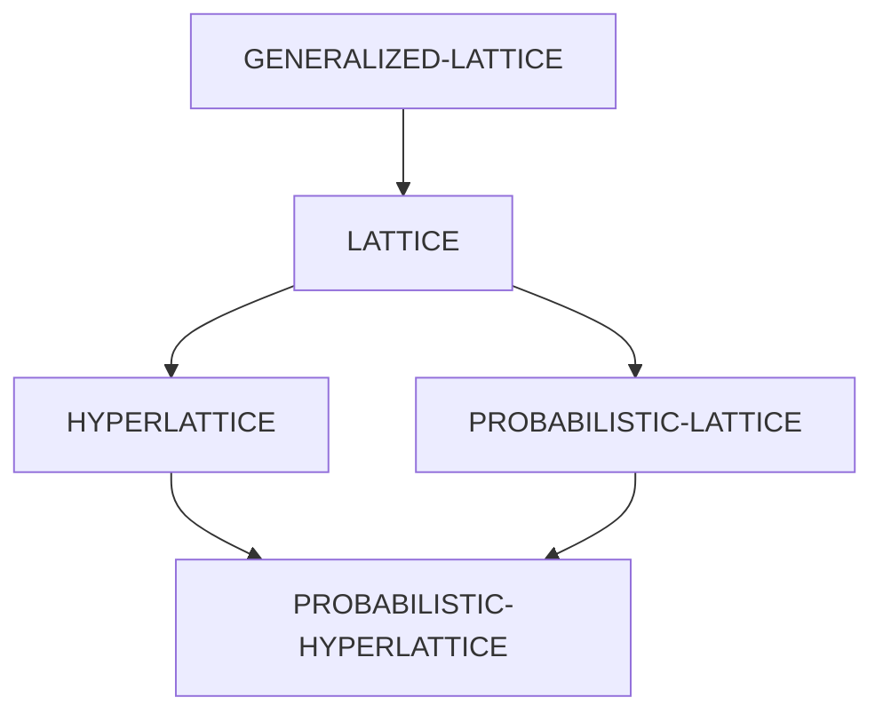

# HYPERLATTICES

Generalized Lattice data-types for Common Lisp, including Algebraic Lattices, Hyperlattices, and Probabilistic Hyperlattices, which intends to follow the packages-as-types convention (as defined by the [BAPHOMET][] library).

> :warning: **This library is a work in progress. Things will be added. Things will be removed. Things will change. Things will blow up. Embrace the uncertainty.**

## Overview

### Class Hierarchy

### Generic Function API

`supremum`

`infimum`

`join`

`meet`

`element-of`

`relation-of`

`supremum-of`

`infimum-of`

`member-p`

`closure`

`cover`

`dimension`

`chain`

`antichain`

`slice`

`merge`

`longest-chain-p`

`largest-antichain-p`

`homomorphic-p`

`isomorphic-p`

`congruent-p`

## Documentation

Documentation for the `hyperlattices` library is available at:

https://thephoeron.github.io/hyperlattices/

## To Do

- [x] Add `parachute` test suite scaffolding
- [ ] Implement unit tests for all type classes and methods
- [x] Implement `LATTICE` class and functional interface
- [x] Implement `HYPERLATTICE` class and functional interface
- [x] Implement `PROBABILISTIC-HYPERLATTICE` class and functional interface
- [ ] Implement `GENERALIZED-LATTICE` class and dispatching methods
- [ ] Implement `PROBABILISTIC-LATTICE` class and specialized methods
- [ ] Implement Generic Function API over `GENERALIZED-LATTICE` class
- [ ] Refactor `LATTICE` class and functions to inherit from `GENERALIZED-LATTICE` class and use Generic Function API
- [ ] Refactor `HYPERLATTICE` class and functions to inherit from `LATTICE` class and use Generic Function API
- [ ] Refactor `PROBABILISTIC-HYPERLATTICE` class and functions to inherit from `HYPERLATTICE` and `PROBABILISTIC-LATTICE` classes and use Generic Function API
- [ ] Refactor library to use `BAPHOMET` package-as-type convention
- [x] Publish `hyperlattices` on Ultralisp
- [ ] Publish `hyperlattices` on Quicklisp

## Supported Implementations

The `hyperlattices` library has been developed and tested on macOS for the following Common Lisp implementations:

- [LispWorks][] 8.0.1 (64-bit)
- [Allegro CL][] 10.1
- [SBCL][] 2.3.4
- [ABCL][] 1.9.1
- [ECL][] 21.2.1
- [CLISP][] 2.49.92
- [CLASP CL][] 2.3.0-20-g1c6d486bc
- [Clozure CL][] 1.12.1

## Credits

### Authors

- ["the Phoeron" Colin J.E. Lupton][@thephoeron]

### Created with

- [GitHub Copilot Chat][GitHubCopilotX] (Private Beta)
- [Alive][AliveExtension] (the Average Lisp VS Code Environment)

### References

_General Lattice Theory, Second Edition_, by George A. Grätzer.
2003, Birkhäuser Verlag Basel/Switzerland

_Introduction to Lattice Theory with Computer Science Applications_, by Vijay K. Garg.
2015, John Wiley & Sons, Inc.

_Probabilistic Lattices: With Applications to Psychology_, by Louis Narens.
Advanced Series on Mathematical Psychology, Vol. 5.
2015, World Scientific Publishing Co.

_Theory of Nonlinear Lattices, Second Enlarged Edition_, by Morikazu Toda.
Springer Series in Solid-State Sciences, Vol. 20.
1989, Springer-Verlag Berlin Heidelberg.

## License

Copyright &copy; 2023, ["the Phoeron" Colin J.E. Lupton][@thephoeron]. Released under the MIT License.

[GitHubCopilotX]: https://github.com/features/preview/copilot-x
[@thephoeron]: https://github.com/thephoeron
[AliveExtension]: https://marketplace.visualstudio.com/items?itemName=rheller.alive
[BAPHOMET]: https://github.com/thephoeron/baphomet
[LispWorks]: https://www.lispworks.com/
[SBCL]: https://www.sbcl.org/
[Allegro CL]: https://franz.com/products/allegrocl/
[Clozure CL]: https://ccl.clozure.com/
[ABCL]: https://abcl.org/
[ECL]: https://common-lisp.net/project/ecl/
[CLISP]: https://clisp.sourceforge.io/
[CLASP CL]: https://github.com/clasp-developers/clasp